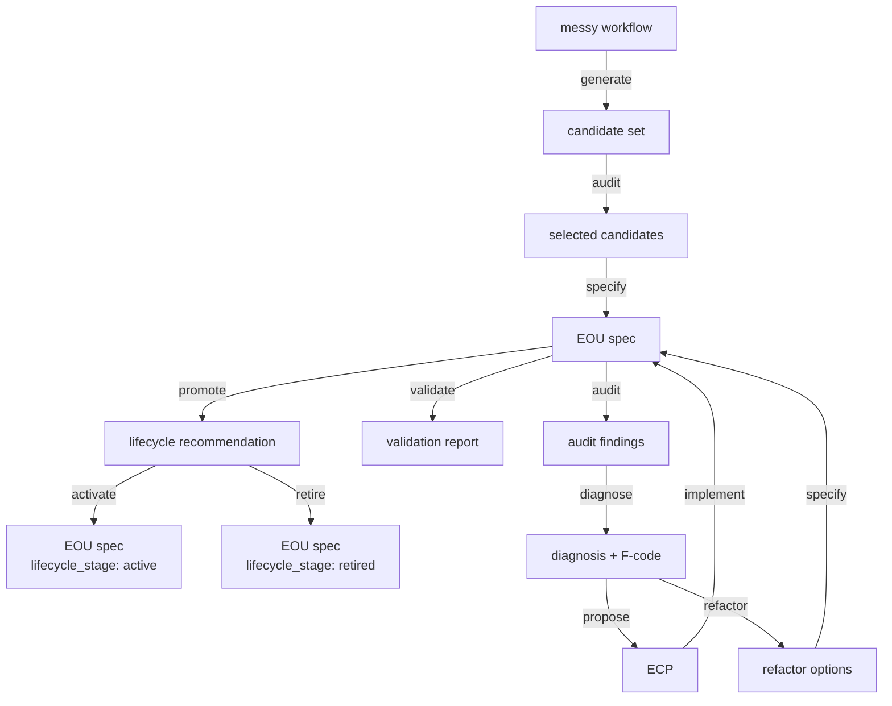
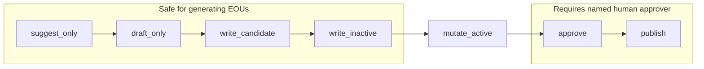
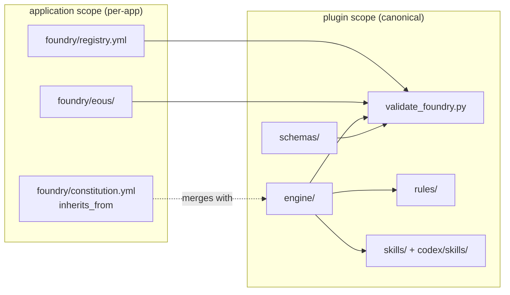

# EOU Foundry Architecture

This document describes the canonical architecture of the EOU Foundry: the faceted classification model, the governance pipeline, and the generating-EOU safety design.

---

## Part 1 — Faceted classification

### Core correction from V1

The original design treated EOU type as a single flat label: `deterministic`, `judgment`, `decision`, `generating`. That was too crude. A single label collapses four independent axes — what the unit does, how it runs, how much authority it has, and how mature it is — into one, making it impossible to express nuance like "a judgment-mode audit with limited authority at the draft stage."

The V2 model uses **faceted classification**:

```yaml
classification:
  function:         generate | specify | validate | diagnose | promote | refactor | audit | propose | activate | implement | retire
  target_object:    string   # what this EOU acts on
  automation_mode:  deterministic | LLM_assisted | human_executed | hybrid
  authority_level:  suggest_only | draft_only | write_candidate | write_inactive | mutate_active | approve | publish
  risk_level:       low | medium | high | critical
  lifecycle_stage:  candidate | draft | simulated | pilot | active | monitored | stable | deprecated | retired
```

No single facet decides authority or risk on its own. The combination does.

A compliant label looks like:

```text
function: audit
target_object: candidate EOU set
automation_mode: LLM_assisted
authority_level: write_inactive
risk_level: medium
lifecycle_stage: draft
```

A non-compliant label looks like:

```text
type: audit_eou
```

Do not use a single vague type label. Authority and risk must be explicit facets, not inferred from a name.

### Core principle

An EOU is an operational hypothesis:

```text
Given inputs X,
context Y,
procedure Z,
and validation tests T,
this unit can produce output O
within acceptable risk R.
```

The Foundry manages those hypotheses.

### Function vocabulary

| Value | Meaning |
|-------|---------|
| `generate` | Produces candidate outputs (EOU specs, regression cases, ECPs, refactor options). Subject to Rule 95 generation-envelope constraints. |
| `specify` | Turns an approved candidate into a complete, schema-conformant EOU spec at draft stage. |
| `validate` | Checks structural integrity of schemas, registry, and specs. Produces a validation report; does not repair. |
| `diagnose` | Classifies a failure using the F-code taxonomy and recommends minimum-blast-radius repairs. |
| `promote` | Evaluates an EOU against maturity gates and recommends a lifecycle transition. |
| `refactor` | Produces structural refactor options for an EOU based on audit findings. |
| `audit` | Inspects and evaluates an EOU spec, candidate set, or the whole Foundry for quality and compliance. |
| `propose` | Creates a formal EOU Change Proposal from a diagnosed failure or refactor option. |
| `activate` | Executes an approved lifecycle transition (typically to `active`). Requires human-approved recommendation on record. State-changing — does not evaluate. |
| `implement` | Executes an approved ECP: applies changes, updates the EOU spec and registry, moves ECP to `implemented/`. Requires approved ECP. State-changing. |
| `retire` | Executes retirement of an EOU: sets `lifecycle_stage: retired`, documents successor or owner decision. Requires human approval. State-changing. |



### Authority level vocabulary

| Level | What it permits |
|-------|----------------|
| `suggest_only` | Read and report; no writes |
| `draft_only` | Write draft artifacts in scratch space only |
| `write_candidate` | Write candidate artifacts to candidate directories |
| `write_inactive` | Write to non-active governance files (audits, validation reports) |
| `mutate_active` | Modify active EOU specs or governance files — requires ECP |
| `approve` | Set approval status — requires named human approver |
| `publish` | Publish or deploy — requires named human approver |

Generating EOUs must not hold `mutate_active`, `approve`, or `publish`.



### Canonical file structure

The tree splits cleanly into **plugin scope** (what the plugin owns and ships) and **application scope** (what each consuming app owns). Apps inherit engine artifacts; they do not copy them.

```text
# PLUGIN SCOPE — canonical, lives in the plugin checkout / install
plugin/
  .claude-plugin/plugin.json
  schemas/                       # ground-truth schemas
    eou.schema.yml
    ecp.schema.yml
    candidate-set.schema.yml     # v0.6.0 (ECP-0013)
    incident.schema.yml
    regression-case.schema.yml
    audit-report.schema.yml
    registry-entry.schema.yml
    run-trace.schema.yml
    no-trace-justification.schema.yml
    constitution.schema.yml
  engine/                        # canonical engine artifacts (v0.5.0+, ECP-0003)
    constitution-defaults.yml    # body inherited via inherits_from
    failure-taxonomy.yml
    maturity-model.yml
    refactoring-patterns.yml
    runtime-contract.yml
    governance.yml
    meta-eous/                   # canonical generating / governing EOUs
      generate-eou-candidates.yml
      audit-candidate-eou-set.yml
      eou-specify.yml
      ...
  scripts/
    validate_foundry.py          # walks app foundry/ + reads plugin engine/
    runs.py                      # record_run() helper (ECP-0007)
    init_app.sh                  # scaffolds a fresh application
  rules/                         # enforcement docstrings
  skills/                        # Claude skills
  codex/skills/                  # Codex mirrors

# APPLICATION SCOPE — each consuming app owns this tree
app/
  foundry/
    constitution.yml             # `inherits_from: "eou-foundry@>=0.5.0"` + app preamble + *_additional
    registry.yml                 # app's own EOU registry
    eous/                        # app-owned work EOUs
    meta-eous/                   # optional: app-owned overrides of canonical meta-EOUs
    overrides/                   # optional: app-specific overrides of engine artifacts (ECP-0004)
    self-evolution/
      ecp/{proposed,implemented,approved,rejected}/
      regression/cases/
      candidate-sets/            # canonical candidate-set artifacts (v0.6.0, ECP-0013)
      refactor-options/
    audits/
      eou-audits/
      foundry-audits/
      candidate-set-audits/
      incidents/
      no-trace/                  # no-trace-justification artifacts (ECP-0014 escape hatch)
  runs/                          # execution traces (foundry/runs/{eou_id}/{run_id}.yml)
```



### Canonical anti-patterns

Reject:

```text
generate → activate            (bypasses governance pipeline)
self-approval                  (same executor approves own output)
schema drift                   (specs, validators, docs disagree)
process inflation              (more EOUs than failures prevented)
validator weakening without ECP
new EOUs without evidence of need
high pass rate as proxy for quality
```

Accept:

```text
generate → argue against → rank → minimal subset → audit → specify → simulate → approve → activate
```

The Foundry is successful only if it becomes better at detecting and correcting its own false confidence.

---

## Part 2 — Generating EOU governance

### `generate` is a function facet, not a complete type

A unit that generates candidate EOUs, regression cases, refactor options, or ECPs must still declare all six facets. The `function` says what the unit does. The `authority_level` says what it is allowed to change. The `risk_level` says how dangerous failure is. The `lifecycle_stage` says how much trust the system places in it.

Do not collapse those dimensions into a single label.

### Foundational rule

Generating EOUs may produce **candidates**. They may not create authority.

They may create:

```text
candidate EOU specs
candidate schemas
candidate regression cases
candidate refactor options
candidate ECPs
```

They may not create:

```text
active EOUs
approved EOUs
production schemas
weakened validators
constitution changes
human approval records
published output
```

The safe path:

```text
generate candidates
→ argue against them
→ rank candidates
→ select the minimal useful set
→ audit the candidate set
→ specify selected EOUs
→ simulate
→ human approval
→ activate
```

Never: `generate → activate`


### Generation envelope

Every generating EOU must declare a generation envelope:

```yaml
generation_envelope:
  allowed_outputs:
    - candidate_eou_spec
    - candidate_regression_case
    - candidate_refactor_option
    - candidate_ecp
  forbidden_outputs:
    - active_eou
    - approved_eou
    - constitution_change
    - validator_weakening_without_ecp
  max_candidates: 7            # constitution-authorized ceiling
  default_status: candidate    # must be "candidate"
  required_for_each_candidate:
    - arguments_against
    - minimality_result
    - classification.authority_level
    - classification.risk_level
```

The envelope prevents a generating unit from becoming an uncontrolled procedure factory.

### Generation budget

Generation must be budgeted:

```yaml
generation_budget:
  max_candidates: 7            # per-run planned upper bound; <= envelope.max_candidates
  max_new_schemas: 2
  max_new_validators: 3
  max_open_questions: 10
  must_rank_candidates: true
  must_select_minimal_set: true
```

Without a budget, generating EOUs overproduce because structure is cheap to generate.

### Registry diff

Before proposing a new EOU, the generating unit must compare against the registry:

```yaml
registry_diff:
  required: true
  questions:
    - Does this duplicate an existing EOU?
    - Does it extend an existing EOU that should be refactored instead?
    - Should this be a regression case or stop condition rather than a new EOU?
```

New EOUs should be the last resort.

### Minimality test

Before accepting a generated EOU candidate, ask whether the need can be satisfied by:

```text
a rule
a schema field
a validator
a regression case
a stop condition
a checklist item inside an existing EOU
a human approval gate
```

A new EOU is justified only when it has a distinct success criterion and prevents a concrete failure or improves a concrete decision.

### Operational value test

A generated candidate must explain its operational value. Reject candidates that cannot identify at least one of:

```text
prevents_failure      — names a specific failure class and concrete example
improves_decision     — names the decision and the previous problem
exposes_hidden_judgment — names the judgment and why it was hidden
improves_traceability — names what trace is now captured that was not before
```

### Counter-generation

Every candidate must include an argument against itself:

```yaml
counter_generation:
  required: true
  requires_for_each_candidate:
    - arguments_against
    - minimality_result
```

The Foundry should generate against itself. This is the main protection against process inflation.

### Candidate set as governed artifact

As of v0.6.0 (ECP-0013), the candidate set is a schematized, validator-enforced artifact, not a documentation convention.

**Canonical path:** `foundry/self-evolution/candidate-sets/cs-{generating_eou_id}-{YYYYMMDD}-{hhmm}.yml`

**Schema:** `schemas/candidate-set.schema.yml`. Required top-level fields: `id`, `generated_by`, `generated_at`, `target_class` ∈ {`eou_spec`, `ecp`, `regression_case`, `refactor_option`}, `candidates`, `audit_outcome`, `audit_status` ∈ {`pending_audit`, `audited`, `rejected_in_full`}.

**Audit outcome contract:** the `audit_outcome` block must declare all seven keys — `accepted`, `merged`, `demoted_to_rule`, `demoted_to_validator`, `demoted_to_stop_condition`, `rejected`, `minimal_recommended_subset` — even if some are empty pre-audit. An `audit_status: audited` set with both `minimal_recommended_subset` and `rejected` empty hard-fails validation; an audited set must say something explicit about what survived.

**Per-candidate contract:** every candidate inside the set must have `status: candidate` and non-empty `arguments_against`. Generators cannot emit candidates at any other lifecycle state, and the counter-generation requirement is enforced at the artifact level, not just the spec level.

### Candidate set audit (as a system)

A generated candidate set must be audited as a system, not only as individual units.

A candidate set can fail when:

```text
there are too many EOUs
responsibilities overlap
there is no audit path
there is no validation path
there is no approval gate
high-risk decisions are delegated to AI
no trace unit exists
generated units are not ranked by value
```

A candidate-set audit asks:

```text
Does the set contain the minimum viable operating system?
Does each unit have one distinct success criterion?
Are generation, audit, revision, validation, and approval separated?
Are high-risk decisions human-owned?
Does the set include traceability?
Are rejected candidates recorded?
Is there a recommended minimal subset?
```

---

## Part 3 — Recursive self-improvement

The Foundry can inspect and improve its own EOUs, but only through bounded governance.

### Required change pipeline

```text
observe failure or audit finding
→ diagnose (assign F-code, rank repair options)
→ propose ECP
→ simulate (populate ECP simulation field)
→ regression test (add regression case)
→ audit (produce audit.yml)
→ human approval (named human sets approval.status: approved)
→ implement (apply ECP; move to implemented/)
→ registry update
```

No step may be skipped. Each step produces a traceable artifact.


### Forbidden shortcuts

```text
observe → edit EOU spec directly
observe → edit → approve (self)
audit → implement (skipping ECP and human approval)
```

No EOU may be the sole judge of changes to itself. The EOU that proposes a change and the EOU that audits it must have different `responsibility.executor` values.

### No-change outcome

Not every diagnosis leads to a change proposal. When diagnosis finds insufficient evidence for an EOU change, record a no-change decision:

```text
foundry/audits/incidents/{incident_id}.no-change.yml
```

Required fields: `incident_id`, `eou_id`, `diagnosis_summary`, `decision: no_change`, `rationale`, `reviewed_by`, `reviewed_at`, `reopen_condition`.

### Lifecycle/evidence triangle (v0.6.0)

ECPs 0007, 0009, 0010, and 0014 together turn lifecycle claims from self-declarations into evidence-bound assertions. Three coupled checks:

1. **Activation evidence (ECP-0010).** Every registry entry at `status` ∈ {active, monitored, stable} must populate `activated_by` with either `{ecp_id, approver, activated_at}` or a legacy bootstrap escape `{legacy_bootstrap: true, bootstrap_justification, bootstrap_expires_at}`. No EOU enters an active stage without a recorded path through governance.

2. **Maturity evidence (ECP-0009).** The registry entry's `maturity` claim must be at or above the level required by its `lifecycle_stage` per `engine/maturity-model.yml`. An EOU at `active` claiming `L2_STRUCTURED` fails validation. Self-declared maturity is rejected at the validator level.

3. **Trace gate (ECP-0014, hard-cut).** Every EOU at active/monitored/stable must EITHER declare a non-empty `outputs.trace` listing paths under `runs/` OR have a non-expired `foundry/audits/no-trace/{eou_id}.yml` justification with a named human reviewer (rejected if `reviewed_by` matches `/^TODO/i`). No warning phase, no deprecation window — writing a no-trace-justification is the explicit migration path.

The dependency DAG (ECP-0009) closes the loop: registry entries declare `dependencies.eous` lists; the validator walks the resulting DAG, refuses cycles and references to retired EOUs. Refactor blast-radius becomes a graph traversal rather than guesswork.

---

## Part 4 — Engine vs application scope

Before v0.5.0, every scaffolded application carried a snapshot copy of the Foundry engine — `failure-taxonomy.yml`, `maturity-model.yml`, `governance.yml`, `runtime-contract.yml`, plus the meta-EOU templates — written into its own `foundry/` tree at init time. This was a layering violation. Apps drifted from the engine as the plugin evolved; engine fixes did not propagate; "is this app's `maturity-model` what we ship now?" had no answer without diffing trees.

ECP-0003 resolved this: **engine artifacts live canonically in the plugin; applications reference them, never snapshot them.**

### What lives where

| Lives in plugin (engine scope) | Lives in app (application scope) |
|---|---|
| `engine/constitution-defaults.yml` (body) | `foundry/constitution.yml` (preamble + `inherits_from`) |
| `engine/failure-taxonomy.yml` | (optional) `foundry/overrides/failure-taxonomy.yml` |
| `engine/maturity-model.yml` | (optional) `foundry/overrides/maturity-model.yml` |
| `engine/governance.yml` | (optional) `foundry/overrides/governance.yml` |
| `engine/runtime-contract.yml` | (optional) `foundry/overrides/runtime-contract.yml` |
| `engine/refactoring-patterns.yml` | (optional) `foundry/overrides/refactoring-patterns.yml` |
| `engine/meta-eous/*.yml` (canonical generators/auditors) | `foundry/eous/*.yml` (app work EOUs) |
| `schemas/*.yml` (ground truth) | `foundry/registry.yml` (app registry) |

### How inheritance works

An application's `foundry/constitution.yml` declares:

```yaml
inherits_from: "eou-foundry@>=0.5.0"

application:
  id: "book-workshop"
  description: "..."
  owner: "jane.doe"

invariants_additional: [...]
forbidden_additional: [...]
generation_invariants_additional: [...]
```

The validator (ECP-0005 parser):
1. Resolves the plugin install via `EOU_FOUNDRY_PLUGIN_PATH` env, then `claude plugin path`, then `Path(__file__).parents[1]`.
2. Refuses if the installed plugin version doesn't satisfy the `inherits_from` constraint (`==`, `>=`, or `~=`).
3. Merges `engine/constitution-defaults.yml` as base, then layers the app's local file on top, then layers `foundry/overrides/<file>.yml` if present.
4. **Refuses any merge that drops or weakens an engine key.** Lists (invariants, forbidden, generation_invariants) require local re-declarations to be supersets of engine. `change_rules` requires every engine key to remain present. `purpose` cannot be emptied.

### Engine canonical meta-EOUs are not in the app registry

`engine/meta-eous/audit-eou.yml`, `engine/meta-eous/generate-eou-candidates.yml`, etc. are plugin-owned. The validator indexes them but does NOT require them to appear in `foundry/registry.yml` (this was ECP-0003's follow-on fix). The app's registry lists only the app's own work EOUs.

### Override merge semantics

If an app needs to diverge from an engine artifact, the path is:

1. Place `foundry/overrides/<engine-file>.yml` containing the override.
2. The validator merges it over the engine canonical, key by key.
3. The override may *add* keys or *strengthen* values; it cannot drop a key that the engine declares.
4. If divergence is fundamental (a different `maturity-model.yml` entirely), the path is an ECP against the plugin, not an override hidden in the app.

This is the structural answer to the question V6's audit raised: how does the system stay theory-of-control-aligned across many consuming applications without each app silently drifting? **The engine is canonical; the apps are products.**

### What apps still own

- Their own work EOUs (`foundry/eous/`)
- Their own registry (`foundry/registry.yml`)
- Their own application preamble in the constitution
- Their own additions to engine invariants (`invariants_additional`, `forbidden_additional`, etc.) — additive only, never subtractive
- Their own ECPs (`foundry/self-evolution/ecp/`)
- Their own candidate sets, regression cases, audits, incidents, run traces
- Their own no-trace-justifications when the trace gate forces an explicit exemption
