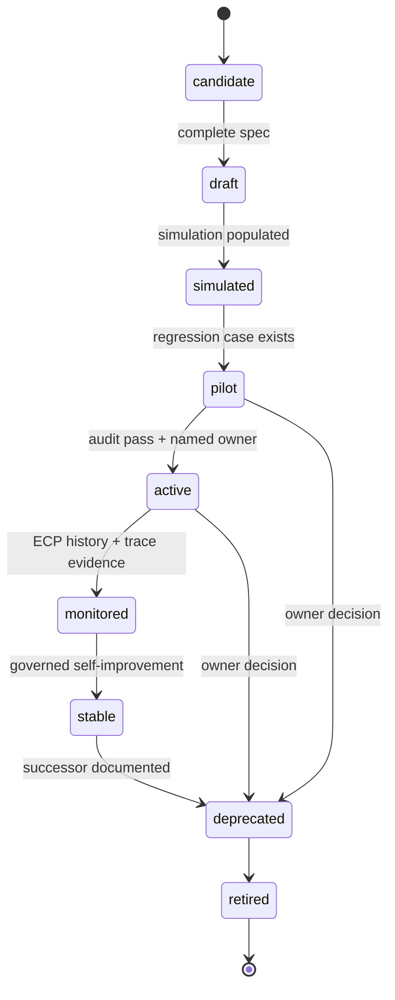
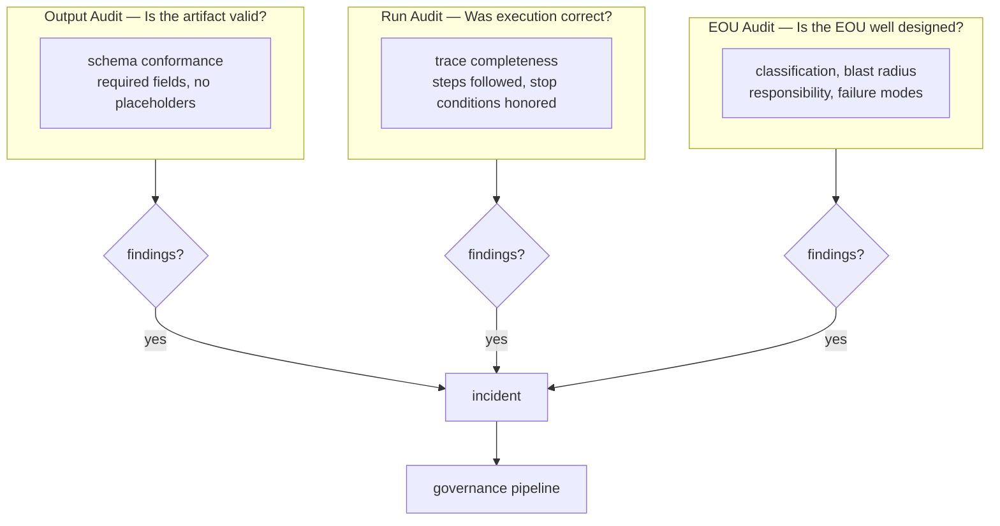
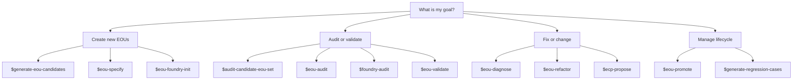

# EOU Design and Maintenance Doctrine

The current practical doctrine for designing, maintaining, and governing EOUs.

## Definition

An **EOU — Executable Operating Unit** — is a bounded operating unit that transforms specified inputs into specified outputs under explicit constraints, validation, authority, and responsibility.

The most important definition:

> An EOU is a testable operating hypothesis, not a prompt, checklist, SOP, or script.

It claims:

```text
Given inputs X,
under context Y,
using procedure Z,
with authority A,
and validation V,
this unit can produce output O
within acceptable risk R.
```

A good EOU is not judged by whether it produces something impressive. It is judged by whether its output is valid, traceable, auditable, and worth the operational cost.

## 1. Core standard

The EOU framework should optimize for:

```text
reduced hidden failure
```

Not merely:

```text
more automation
more output
faster execution
fewer warnings
higher pass rate
less human involvement
```

The strongest EOU systems do not just make work faster. They make it harder for the organization or individual to fool themselves.

A system is improving when it catches more of its own false confidence.

## 2. Mandatory EOU fields

Every serious EOU must contain these fields.

```yaml
id: string
name: string
version: string

classification:
  function:         generate | specify | validate | diagnose | promote | refactor | audit | propose | activate | implement | retire
  target_object:    string
  automation_mode:  deterministic | LLM_assisted | human_executed | hybrid
  authority_level:  suggest_only | draft_only | write_candidate | write_inactive | mutate_active | approve | publish
  risk_level:       low | medium | high | critical
  lifecycle_stage:  candidate | draft | simulated | pilot | active | monitored | stable | deprecated | retired

purpose:
  statement: string          # one sentence: what failure it prevents or decision it improves
  non_goals: []

operating_hypothesis: string

inputs:
  required: []
  optional: []
  forbidden_assumptions: []

context_manifest:
  source_of_truth: []
  supporting: []
  forbidden: []

execution:
  steps: []
  decision_points: []
  stop_conditions: []
  allowed_tools: []
  prohibited_actions: []

outputs:
  primary: []
  secondary: []
  trace:
    - runs/{run_id}/trace.yml

success_criteria:
  must_pass: []
  should_pass: []

validation:
  deterministic: []          # machine-checkable: field presence, schema conformance
  judgment: []               # requires human or LLM review
  red_team: []               # adversarial scenarios to test boundary robustness

failure_modes:
  known: []
  warning_signs: []
  repair_actions: []

escalation:
  require_human_when: []
  require_approval_for: []

responsibility:
  executor: string
  reviewer: string
  approver: string
  cannot_delegate: []

blast_radius:
  allowed_scope: []
  forbidden_scope: []

versioning:
  supersedes: []
  changelog: []
```

The authoritative source is `schemas/eou.schema.yml`. If this document and the schema drift, the schema wins.

## 3. Three essential questions

Before creating any EOU, ask three questions.

### What failure does this prevent?

Bad answer:

```text
It makes the process more organized.
```

Good answer:

```text
It prevents a generated candidate from entering the active registry without a human-approved ECP on record.
```

### What decision does this improve?

Bad answer:

```text
It helps the workflow.
```

Good answer:

```text
It helps decide whether a candidate EOU should be activated, rejected, or merged into an existing EOU.
```

### What hidden judgment does this expose?

Bad answer:

```text
It checks quality.
```

Good answer:

```text
It exposes whether the EOU's blast_radius.allowed_scope is consistent with its declared authority_level — a mismatch that is not visible from the authority field alone.
```

If an EOU cannot answer these questions, it should remain a note, not an operating unit.

## 4. EOU creation should be conservative

A new EOU is not a free asset. It creates:

```text
schema burden
maintenance burden
registry burden
validation burden
audit burden
retirement burden
```

Default rule:

```text
Do not create a new EOU unless needed.
```

Before creating a new EOU, test whether the need can be satisfied by:

```text
a field in an existing EOU
a validation rule
a stop condition
a regression case
a checklist item
a context-manifest update
a human approval gate
a refactor of an existing EOU
```

The Foundry should reward fewer, sharper EOUs, not more, prettier EOUs.

## 5. Separate generation, audit, revision, and approval

Never let one unit do all four.

```text
generate = produce candidate output
audit    = detect failures
revise   = repair specific failures
approve  = accept responsibility
```

Dangerous design:

```text
generate output
→ audit output
→ revise output
→ approve output
```

all inside one EOU.

Better design:

```text
generate-eou-candidates
→ audit-candidate-eou-set
→ eou-specify
→ eou-audit
→ human approval
→ promote
```

The same unit should not approve its own output.

## 6. Generating EOUs need special controls

A generating EOU is dangerous because it can create operational complexity.

It may generate:

```text
candidate EOU specs
candidate schemas
candidate regression cases
candidate refactor options
candidate ECPs
```

It may not generate:

```text
active EOUs
approved EOUs
production schemas
weakened validators
constitution changes
approval records
published output
```

The safe pattern:

```text
generate candidates
→ argue against candidates
→ rank candidates
→ select minimal useful set
→ audit candidate set
→ specify selected EOUs
→ simulate
→ approve
→ activate
```

Every generating EOU must declare a `generation_envelope`, `generation_budget`, `registry_diff`, `minimality_test`, `operational_value_test`, and `counter_generation`.

Generation without deletion pressure becomes bureaucracy.

## 7. Candidate set audit

Generated EOUs must be audited as a set, not only individually.

A candidate set can fail even if every candidate looks plausible.

Candidate set audit should ask:

```text
Does this set contain too many EOUs?
Are responsibilities overlapping?
Is there at least one audit path?
Is there at least one validation path?
Is approval separated from generation?
Are high-risk decisions human-owned?
Does each unit have a distinct success criterion?
Does each candidate prevent a concrete failure or improve a concrete decision?
Is there a minimal recommended subset?
Are rejected candidates recorded?
```

This protects the Foundry from process inflation.

## 8. Lifecycle discipline

Do not treat all EOUs as equally trustworthy.

Lifecycle stages and their maturity equivalents:

| Stage | Maturity | Trust level |
|-------|----------|-------------|
| `candidate` | L1 — Narrative | No trust; under evaluation |
| `draft` | L2 — Structured | Structured; not yet simulated |
| `simulated` | L2+ | Simulated; not yet piloted |
| `pilot` | L3 — Executable | Limited live use; monitored closely |
| `active` | L4 — Auditable | Full use; audit coverage required |
| `monitored` | L5 — Governed | Active with governance oversight |
| `stable` | L6 — Self-improving | Mature; regression coverage; ECP history |
| `deprecated` | — | Successor documented; no new use |
| `retired` | — | Removed from registry |

Promotion must require evidence:

```text
candidate → draft:    complete spec, no open questions
draft → pilot:        simulation field populated, regression case exists
pilot → active:       passing audit, named human owner, regression coverage
active → monitored:   ECP history, operational trace evidence
monitored → stable:   demonstrated self-improvement through governed ECPs
any → deprecated:     successor EOU documented or owner retirement decision recorded
```

An EOU should never self-declare maturity.



## 9. Trace is mandatory

Every meaningful EOU run must produce a trace:

```yaml
run_trace:
  run_id: string
  eou_id: string
  eou_version: string
  status: completed | completed_with_warnings | failed | stopped
  inputs_used: []
  context_loaded: []
  steps_completed: []
  decision_points_triggered: []
  warnings: []
  outputs: []
  validation_results: []
  human_approval:
    required: true | false
    status: pending | approved | rejected | not_required
```

Without trace, failure cannot be diagnosed. Without diagnosis, improvement is fake.

## 10. Three audit layers

A mature EOU system needs three different audits.

### Output audit

Question: Is the produced artifact valid?

### Run audit

Question: Was the EOU executed correctly?

### EOU audit

Question: Is the EOU itself well designed?

Most systems only audit outputs. That is insufficient.



## 11. Failure taxonomy

Every failure should be named using the F-code taxonomy.

```text
F1   Input Failure          — missing or malformed required inputs
F2   Context Failure        — wrong or stale context loaded
F3   Schema Failure         — schema mismatch between components
F4   Scope Failure          — EOU attempts work outside its declared scope
F5   Instruction Failure    — ambiguous or contradictory execution steps
F6a  Structural Judgment    — EOU conflates two distinct judgments (repair: split or responsibility-separation)
F6b  Coverage Judgment      — right judgment framed, but no validation criteria to test it
F7   Validation Failure     — validator passes while output is invalid
F8   Tool Failure           — allowed tool produces unexpected or wrong output
F9   Trace Failure          — run trace absent, incomplete, or unfalsifiable
F10  Responsibility Failure — no named owner, approver, or non-delegable authority
F11  Lifecycle Failure      — lifecycle_stage inconsistent with actual maturity or gates
F12  Drift Failure          — spec, validator, skill, and docs disagree silently
F13  Performance Failure    — EOU runs correctly at small scale but degrades at operational scale
```

Named failures lead to targeted repairs:

```text
F3  Schema Failure           → canonicalize schema; update all consumers
F4  Scope Failure            → split, merge, or redefine EOU boundary
F6a Structural Judgment      → responsibility-separation or split refactor
F6b Coverage Judgment        → add judgment predicates, regression cases
F7  Validation Failure       → improve validator; add regression case
F10 Responsibility Failure   → add named owner and approval gate
F12 Drift Failure            → reconcile specs, scripts, docs, validators
F13 Performance Failure      → add scale-specific stop condition or tiered execution path
```

## 12. Incidents and regression memory

Every serious failure should become an incident:

```yaml
incident:
  id: inc-0007
  affected_eou: eou-diagnose
  failure_class: F12_DRIFT_FAILURE
  summary: >
    Diagnosis EOU referenced old output path foundry/audits/{id}.diagnosis.yml
    while consuming skill read from foundry/audits/incidents/{id}.diagnosis.yml.
  root_causes:
    - Output path in meta-EOU template was not updated when directory structure changed.
    - No path-consistency check existed in the validator.
  corrective_actions:
    - Align output paths across meta-EOU, skill, and schema.
    - Add path-pattern regression case.
```

Then convert it into regression memory:

```yaml
regression_case:
  id: reg-output-path-001
  target_eou: eou-diagnose
  failure_class: F12_DRIFT_FAILURE
  failure_observed: >
    Diagnosis EOU wrote to old path; consuming skill could not find the output.
  expected_behavior:
    output_path_matches: foundry/audits/incidents/{id}.diagnosis.yml
```

A failure that does not become memory will return.

### Diagnosis outcomes

Every diagnosis produces one of two outcomes:

- `change` — opens an ECP and enters the governance pipeline
- `no_change` — records a no-change decision in `foundry/audits/incidents/{incident_id}.no-change.yml`

A no-change record is not failure of the diagnosis process. It is evidence that the system reviewed and rejected a change rather than silently ignoring the incident.

## 13. ECPs: controlled change

Any significant change must go through an **EOU Change Proposal**.

Require ECPs when changing:

```text
purpose
schema
validation rules or validators
stop conditions
authority_level
risk_level
blast_radius.forbidden_scope
maturity gate requirements
constitution
```

No silent mutation.

ECP lifecycle:

```text
proposed → simulated → regression-tested → audited → approved (named human) → implemented
```

## 14. Constitution

A recursive Foundry needs a slow-changing constitution.

Core invariants:

```text
No EOU may approve its own change alone.
No active EOU may lack an owner.
Every active EOU must produce trace.
Every promoted change must pass regression tests.
Validation cannot be weakened without explicit approval.
Failure history cannot be deleted.
Warnings cannot be suppressed to improve apparent performance.
Human owner retains final authority over high-impact changes.
Uncertainty must be exposed, not hidden.
```

The constitution is the boundary against runaway recursion. Constitutional changes require a separate constitutional ECP process — they cannot go through the ordinary ECP flow.

## 15. EOU portfolio management

A Foundry should manage the entire EOU portfolio, not just individual EOUs.

Portfolio audit should ask:

```text
How many active EOUs exist?
How many are unused?
How many duplicate each other?
How many lack owners?
How many lack traces?
How many have unresolved incidents?
How many are stuck in candidate or draft status?
How many have not been audited recently?
How many high-risk EOUs lack approval gates?
```

A healthy portfolio has:

```text
low duplication
clear ownership
active retirement
strong validation
few stale units
high trace coverage
known risk distribution
```

## 16. Economic discipline

Each EOU has cost.

Costs include:

```text
creation cost
maintenance cost
cognitive overhead
schema overhead
audit overhead
retirement cost
false-positive cost (validator too strict)
false-negative cost (validator too weak)
```

Simple test:

```text
Is the failure this EOU prevents more expensive than the cost of maintaining the EOU?
```

If not, reject or downgrade it.

## 17. Best-practice construction sequence

Use this sequence:

```text
1.  Capture messy workflow.
2.  Identify desired artifact.
3.  Identify hidden judgments.
4.  Identify failure modes.
5.  Identify decision boundaries.
6.  Propose minimal candidate EOUs.
7.  Argue against each candidate.
8.  Select minimal useful set.
9.  Specify selected EOUs (lifecycle_stage: candidate → draft).
10. Add schemas and stop conditions.
11. Simulate or pilot.
12. Produce run trace.
13. Audit output, run, and EOU.
14. Record incidents.
15. Add regression cases.
16. Promote, refactor, or retire.
```

Do not jump from messy workflow directly to automation.

## 18. Red flags

An EOU system is unhealthy if:

```text
EOUs are created faster than they are audited.
Many EOUs lack owners.
Validators mostly check field presence, not value correctness.
Warnings do not change behavior.
Generated candidates become active too quickly.
Pass rates increase after validators are weakened.
Few failures become regression cases.
No one retires EOUs.
AI units approve their own outputs.
Trace is missing or ignored.
The system optimizes for less human involvement rather than better decisions.
```

These are signs of false operational maturity.

## 19. Compact doctrine

A strong EOU is:

```text
bounded
owned
falsifiable
traceable
risk-aware
authority-limited
lifecycle-aware
failure-aware
schema-aligned
auditable
retirable
```

A strong EOU system:

```text
separates generation from approval
treats output as evidence, not proof
records trace
names failures
creates regression memory
uses ECPs for change
maintains a constitution
retires stale units
audits the portfolio
optimizes for reduced hidden failure
```

The deepest principle:

> EOUs should not help the system appear more competent. EOUs should help the system become harder to fool.

## 20. Skill selection


