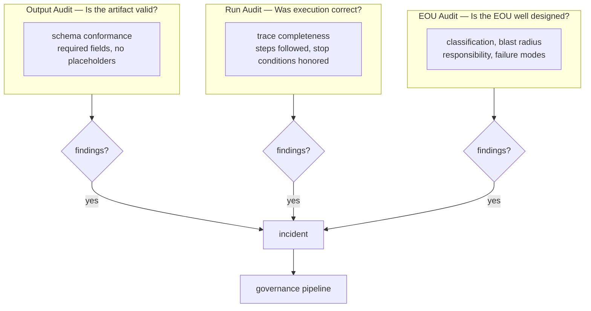
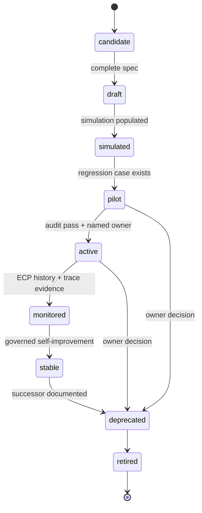
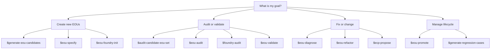

# EOU Design and Maintenance Doctrine

The current practical doctrine for designing, maintaining, and governing EOUs. Organized under seven categories (D1–D7), each protecting a distinct architectural obligation — removing any one leaves a major failure path uncovered.

## Smallest memorable form

```text
Bound the unit.
Expose the judgment.
Trace the run.
Audit the evidence.
Separate authority.
Govern change.
Prune the portfolio.
Discipline the vocabulary.
```

The deepest principle behind all eight:

> EOUs should not help the system appear more competent. EOUs should help the system become harder to fool.

## Definition

An **EOU — Executable Operating Unit** — is a bounded operating unit that transforms specified inputs into specified outputs under explicit constraints, validation, authority, and responsibility.

The most important definition:

> An EOU is a testable operating hypothesis, not a prompt, checklist, SOP, or script.

It claims:

```text
Given inputs X,
under context Y,
using procedure Z,
with authority A,
and validation V,
this unit can produce output O
within acceptable risk R.
```

A good EOU is not judged by whether it produces something impressive. It is judged by whether its output is valid, traceable, auditable, and worth the operational cost.

---

## D1 — Epistemic Standard

> The system exists to make judgment executable enough to scale, inspectable enough to trust, and constrained enough to prevent hidden failure.

### D1.1 — Optimize for reduced hidden failure

The EOU framework should optimize for:

```text
reduced hidden failure
```

Not merely:

```text
more automation
more output
faster execution
fewer warnings
higher pass rate
less human involvement
```

The strongest EOU systems do not just make work faster. They make it harder for the organization or individual to fool themselves. A system is improving when it catches more of its own false confidence.

### D1.2 — Output is evidence, not proof

A polished artifact is not a passing artifact. Validation, audit, and trace are the proof; the artifact is the evidence under examination.

### D1.3 — Judgment must be inspectable

The minimum executable judgment requirement: every EOU at active stage must surface the judgment it performs in a form that a human reviewer can inspect — predicates in `validation.judgment`, or named decision points in `execution.decision_points`. EOUs that perform judgment without naming it convert tacit competence into opaque ritual.

### D1.4 — Falsifiable outputs (governed effect)

Every EOU output should be falsifiable. Weak output: "EOU improved." Better output: "EOU spec now passes Classification completeness, Authority/blast-radius consistency, and No-placeholder checks; still fails Regression coverage."

A falsifiable output is a *governed effect* in V6's vocabulary — typed, named, traceable, attributable to a run, connected to a target artifact. The current schema captures it through `outputs` + `success_criteria` + `validation.deterministic`. Whether to absorb V6's `effect_contract` as a derived metadata block is tracked in `05-v6-design-pulls.md`.

---

## D2 — Unit Design Doctrine

> Create an EOU only when a distinct decision boundary, failure mode, or hidden judgment justifies a bounded operating contract.

### D2.1 — Mandatory EOU fields

Every serious EOU must contain these fields.

```yaml
id: string
name: string
version: string

classification:
  function:         generate | specify | validate | diagnose | promote | refactor | audit | propose | activate | implement | retire
  target_object:    string
  automation_mode:  deterministic | LLM_assisted | human_executed | hybrid
  authority_level:  suggest_only | draft_only | write_candidate | write_inactive | mutate_active | approve | publish
  risk_level:       low | medium | high | critical
  lifecycle_stage:  candidate | draft | simulated | pilot | active | monitored | stable | deprecated | retired

purpose:
  statement: string          # one sentence: what failure it prevents or decision it improves
  non_goals: []

operating_hypothesis: string

inputs:
  required: []
  optional: []
  forbidden_assumptions: []

context_manifest:
  source_of_truth: []
  supporting: []
  forbidden: []

execution:
  steps: []
  decision_points: []
  stop_conditions: []
  allowed_tools: []
  prohibited_actions: []

outputs:
  primary: []
  secondary: []
  trace:
    - runs/{eou_id}/{run_id}.yml

success_criteria:
  must_pass: []
  should_pass: []

validation:
  deterministic: []          # machine-checkable: field presence, schema conformance
  judgment: []               # requires human or LLM review
  red_team: []               # adversarial scenarios to test boundary robustness

failure_modes:
  known: []
  warning_signs: []
  repair_actions: []

escalation:
  require_human_when: []
  require_approval_for: []

responsibility:
  executor: string
  reviewer: string
  approver: string
  cannot_delegate: []

blast_radius:
  allowed_scope: []
  forbidden_scope: []

versioning:
  supersedes: []
  changelog: []
```

The authoritative source is `schemas/eou.schema.yml`. If this document and the schema drift, the schema wins.

### D2.2 — Three essential questions

Before creating any EOU, ask three questions. If it cannot answer all three, it remains a note, not an operating unit.

**What failure does this prevent?**

Bad answer: "It makes the process more organized."
Good answer: "It prevents a generated candidate from entering the active registry without a human-approved ECP on record."

**What decision does this improve?**

Bad answer: "It helps the workflow."
Good answer: "It helps decide whether a candidate EOU should be activated, rejected, or merged into an existing EOU."

**What hidden judgment does this expose?**

Bad answer: "It checks quality."
Good answer: "It exposes whether the EOU's `blast_radius.allowed_scope` is consistent with its declared `authority_level` — a mismatch not visible from the authority field alone."

### D2.3 — Conservative creation

A new EOU is not a free asset. It creates schema burden, maintenance burden, registry burden, validation burden, audit burden, and retirement burden.

Default rule: **do not create a new EOU unless needed.** Before creating one, test whether the need can be satisfied by:

```text
a field in an existing EOU
a validation rule
a stop condition
a regression case
a checklist item
a context-manifest update
a human approval gate
a refactor of an existing EOU
```

The Foundry should reward fewer, sharper EOUs, not more, prettier EOUs.

### D2.4 — Best-practice construction sequence

For any messy workflow:

```text
1.  Capture messy workflow.
2.  Identify desired artifact.
3.  Identify hidden judgments.
4.  Identify failure modes.
5.  Identify decision boundaries.
6.  Propose minimal candidate EOUs.
7.  Argue against each candidate.
8.  Select minimal useful set.
9.  Specify selected EOUs (lifecycle_stage: candidate → draft).
10. Add schemas and stop conditions.
11. Simulate or pilot.
12. Produce run trace.
13. Audit output, run, and EOU.
14. Record incidents.
15. Add regression cases.
16. Promote, refactor, or retire.
```

Do not jump from messy workflow directly to automation.

---

## D3 — Execution Doctrine

> A valid run is bounded, context-aware, stop-condition-aware, honest about automation mode, and trace-producing.

### D3.1 — Trace is mandatory

Every meaningful EOU run must produce a trace at `runs/{eou_id}/{run_id}.yml`:

```yaml
run_trace:
  run_id: string
  eou_id: string
  eou_version: string
  status: success | partial | failed | aborted
  started_at: string
  ended_at: string
  executor_identity: string
  inputs: {}
  context_loaded: []
  steps_completed: []
  warnings: []
  outputs: []
  validation: {}
  human_approval: {}
```

As of v0.6.0 (ECP-0014), the trace obligation is hard-enforced by the validator: every EOU at active/monitored/stable must EITHER declare `outputs.trace` referencing `runs/` paths, OR have a non-expired `foundry/audits/no-trace/{eou_id}.yml` with a named human reviewer. No warning phase. Writing the no-trace-justification is the explicit migration path.

Without trace, failure cannot be diagnosed. Without diagnosis, improvement is fake.

### D3.2 — Automation mode must be honest

Many systems fail because they pretend `LLM_assisted` work is `deterministic`. The `automation_mode` field exists to keep that pretense visible. An EOU that runs LLM-judgment inside a function labelled `deterministic` is structurally lying about its execution model and will fail audit.

### D3.3 — Bounded runs

A single run should be bounded, DAG-like, and stop-condition-aware. The Foundry **over time** is a state machine (incidents become diagnoses become ECPs become revised specs); a **single run** is a DAG — they're different objects. Conflating them is a doctrine error.

### D3.4 — Context must be loaded explicitly

`context_manifest.source_of_truth`, `supporting`, and `forbidden` are not documentation. They define what context the run loads. A run that reads files outside its manifest produces an untraceable execution: the trace records "step completed" but cannot reconstruct what knowledge the step was operating against.

---

## D4 — Evidence and Audit Doctrine

> The system learns only when outputs are falsifiable, runs are traceable, failures are named, and incidents become memory.

### D4.1 — Three audit layers

A mature EOU system needs three different audits, not one:

- **Output audit** — Is the produced artifact valid?
- **Run audit** — Was the EOU executed correctly?
- **EOU audit** — Is the EOU itself well designed?

Most systems only audit outputs. That is insufficient. A perfectly compliant artifact can come from a broken run; a clean run can come from a poorly designed EOU.



### D4.2 — Validation vs audit are distinct

`validate` is deterministic structural checking (schema conformance, field presence, registry consistency). `audit` is judgment-heavy evaluation (design quality, compliance, blast-radius coherence). They are separate verbs with separate output artifacts and separate consumer expectations. Collapsing them produces validators that approve and audits that miss structure.

### D4.3 — Failure taxonomy

Every failure should be named using the F-code taxonomy:

```text
F1   Input Failure          — missing or malformed required inputs
F2   Context Failure        — wrong or stale context loaded
F3   Schema Failure         — schema mismatch between components
F4   Scope Failure          — EOU attempts work outside its declared scope
F5   Instruction Failure    — ambiguous or contradictory execution steps
F6a  Structural Judgment    — EOU conflates two distinct judgments (repair: split or responsibility-separation)
F6b  Coverage Judgment      — right judgment framed, but no validation criteria to test it
F7   Validation Failure     — validator passes while output is invalid
F8   Tool Failure           — allowed tool produces unexpected or wrong output
F9   Trace Failure          — run trace absent, incomplete, or unfalsifiable
F10  Responsibility Failure — no named owner, approver, or non-delegable authority
F11  Lifecycle Failure      — lifecycle_stage inconsistent with actual maturity or gates
F12  Drift Failure          — spec, validator, skill, and docs disagree silently
F13  Performance Failure    — EOU runs correctly at small scale but degrades at operational scale
```

Named failures lead to targeted repairs:

```text
F3  Schema Failure           → canonicalize schema; update all consumers
F4  Scope Failure            → split, merge, or redefine EOU boundary
F6a Structural Judgment      → responsibility-separation or split refactor
F6b Coverage Judgment        → add judgment predicates, regression cases
F7  Validation Failure       → improve validator; add regression case
F10 Responsibility Failure   → add named owner and approval gate
F12 Drift Failure            → reconcile specs, scripts, docs, validators
F13 Performance Failure      → add scale-specific stop condition or tiered execution path
```

### D4.4 — Incidents and regression memory

Every serious failure should become an incident:

```yaml
incident:
  id: inc-0007
  affected_eou: eou-diagnose
  failure_class: F12_DRIFT_FAILURE
  summary: >
    Diagnosis EOU referenced old output path foundry/audits/{id}.diagnosis.yml
    while consuming skill read from foundry/audits/incidents/{id}.diagnosis.yml.
  root_causes:
    - Output path in meta-EOU template was not updated when directory structure changed.
    - No path-consistency check existed in the validator.
  corrective_actions:
    - Align output paths across meta-EOU, skill, and schema.
    - Add path-pattern regression case.
```

Then convert it into regression memory:

```yaml
regression_case:
  id: reg-output-path-001
  target_eou: eou-diagnose
  failure_class: F12_DRIFT_FAILURE
  failure_observed: >
    Diagnosis EOU wrote to old path; consuming skill could not find the output.
  expected_behavior:
    output_path_matches: foundry/audits/incidents/{id}.diagnosis.yml
```

A failure that does not become memory will return.

### D4.5 — Diagnosis has change OR no-change outcome

Every diagnosis produces one of two outcomes:

- `change` — opens an ECP and enters the governance pipeline
- `no_change` — records a no-change decision in `foundry/audits/incidents/{incident_id}.no-change.yml`

A no-change record is not failure of the diagnosis process. It is evidence that the system reviewed and rejected a change rather than silently ignoring the incident. "We looked and decided not to act" is a different artifact than "we never looked."

---

## D5 — Authority, Lifecycle, and Change Doctrine

> Evaluation may recommend. Only authorized governance may mutate. Humans retain approval responsibility for high-impact state change.

### D5.1 — Separate generation, audit, revision, and approval

Never let one unit do all four:

```text
generate = produce candidate output
audit    = detect failures
revise   = repair specific failures
approve  = accept responsibility
```

Dangerous design: one EOU that generates → audits → revises → approves its own output. Better:

```text
generate-eou-candidates
→ audit-candidate-eou-set
→ eou-specify
→ eou-audit
→ human approval
→ promote
```

Rule 94 enforces this structurally: `responsibility.executor` must not equal `responsibility.approver`. The validator checks the equality after normalization and refuses violations.

### D5.2 — Lifecycle stages are evidence-gated trust states

Do not treat all EOUs as equally trustworthy.

| Stage | Maturity | Trust level |
|-------|----------|-------------|
| `candidate` | L1 — Narrative | No trust; under evaluation |
| `draft` | L2 — Structured | Structured; not yet simulated |
| `simulated` | L2+ | Simulated; not yet piloted |
| `pilot` | L3 — Executable | Limited live use; monitored closely |
| `active` | L4 — Auditable | Full use; audit coverage required |
| `monitored` | L5 — Governed | Active with governance oversight |
| `stable` | L6 — Self-improving | Mature; regression coverage; ECP history |
| `deprecated` | — | Successor documented; no new use |
| `retired` | — | Removed from registry |

Promotion requires evidence:

```text
candidate → draft:    complete spec, no open questions
draft → pilot:        simulation field populated, regression case exists
pilot → active:       passing audit, named human owner, regression coverage
active → monitored:   ECP history, operational trace evidence
monitored → stable:   demonstrated self-improvement through governed ECPs
any → deprecated:     successor EOU documented or owner retirement decision recorded
```

An EOU should never self-declare maturity. As of v0.6.0 (ECP-0009), the validator enforces this: registry entries claiming `maturity: L4_AUDITABLE` at `lifecycle_stage: active` must actually be at or above L4 per `engine/maturity-model.yml`. The claim is verified, not trusted.



### D5.3 — Activation requires recorded evidence

As of v0.6.0 (ECP-0010), every registry entry at `status` ∈ {active, monitored, stable} must declare `activated_by`:

```yaml
activated_by:
  ecp_id: ecp-0042-…
  approver: jane.doe
  activated_at: 2026-05-20T12:00:00Z
```

or the legacy bootstrap escape:

```yaml
activated_by:
  legacy_bootstrap: true
  bootstrap_justification: "Pre-v0.6.0 EOU; backfilled during migration"
  bootstrap_expires_at: 2026-08-20T00:00:00Z
```

The bootstrap escape exists for migrating apps; `bootstrap_expires_at` forces re-evaluation. No active EOU enters production without a recorded path through governance, even if the path was retroactive.

### D5.4 — ECPs for controlled change

Any significant change must go through an **EOU Change Proposal**. Require ECPs when changing:

```text
purpose
schema
validation rules or validators
stop conditions
authority_level
risk_level
blast_radius.forbidden_scope
maturity gate requirements
constitution
```

No silent mutation.

ECP lifecycle:

```text
proposed → simulated → regression-tested → audited → approved (named human) → implemented
```

The validator (ECP-0004) refuses approved/implemented ECPs missing `approval.approver` or `approval.rollback_considerations`. Approval is not optional metadata; it is the evidence layer that justifies state change.

### D5.5 — Constitution

A recursive Foundry needs a slow-changing constitution. Core invariants (now in `engine/constitution-defaults.yml`, inherited by every app):

```text
No EOU may approve its own change alone.
No active EOU may lack an owner.
Every active EOU must produce trace.
Every promoted change must pass regression tests.
Validation cannot be weakened without explicit approval.
Failure history cannot be deleted.
Warnings cannot be suppressed to improve apparent performance.
Human owner retains final authority over high-impact changes.
Uncertainty must be exposed, not hidden.
```

The constitution is the boundary against runaway recursion. Constitutional changes require a separate constitutional ECP process — they cannot go through the ordinary ECP flow. The engine-merge model (ECP-0003 + ECP-0004) protects against weakening: apps can strengthen invariants via `invariants_additional`, but cannot drop or relax engine values.

---

## D6 — Creation, Generation, and Portfolio Doctrine

> The Foundry must be harder to expand than to justify. Generated structure must face deletion pressure.

### D6.1 — Generating EOUs may create candidates, not authority

A generating EOU is dangerous because it can create operational complexity faster than humans can audit it.

It may generate:

```text
candidate EOU specs
candidate schemas
candidate regression cases
candidate refactor options
candidate ECPs
```

It may not generate:

```text
active EOUs
approved EOUs
production schemas
weakened validators
constitution changes
approval records
published output
```

Every generating EOU must declare `generation_envelope`, `generation_budget`, `registry_diff`, `minimality_test`, `operational_value_test`, and `counter_generation`. Generation without deletion pressure becomes bureaucracy.

### D6.2 — Candidate set is a governed artifact

As of v0.6.0 (ECP-0013), the candidate set is a schematized artifact at `foundry/self-evolution/candidate-sets/cs-{generator}-{YYYYMMDD}-{hhmm}.yml`, validated against `schemas/candidate-set.schema.yml`. Required:

- All seven `audit_outcome` keys: `accepted`, `merged`, `demoted_to_rule`, `demoted_to_validator`, `demoted_to_stop_condition`, `rejected`, `minimal_recommended_subset`.
- `audit_status` ∈ {`pending_audit`, `audited`, `rejected_in_full`}. An audited set must populate either `minimal_recommended_subset` or `rejected` — saying nothing is not an option.
- Every candidate inside the set has `status: candidate` and non-empty `arguments_against`.

The artifact is the output of `generate-eou-candidates`; the audit step is performed by `audit-candidate-eou-set`. They are typed inputs and outputs, not prose.

### D6.3 — Candidate set audit (as a system)

Generated EOUs must be audited as a set, not only individually. A candidate set can fail even if every candidate looks plausible.

Candidate set audit asks:

```text
Does this set contain too many EOUs?
Are responsibilities overlapping?
Is there at least one audit path?
Is there at least one validation path?
Is approval separated from generation?
Are high-risk decisions human-owned?
Does each unit have a distinct success criterion?
Does each candidate prevent a concrete failure or improve a concrete decision?
Is there a minimal recommended subset?
Are rejected candidates recorded?
```

This protects the Foundry from process inflation.

### D6.4 — Portfolio management

A Foundry should manage the entire EOU portfolio, not just individual EOUs.

Portfolio audit asks:

```text
How many active EOUs exist?
How many are unused?
How many duplicate each other?
How many lack owners?
How many lack traces?
How many have unresolved incidents?
How many are stuck in candidate or draft status?
How many have not been audited recently?
How many high-risk EOUs lack approval gates?
```

A healthy portfolio has low duplication, clear ownership, active retirement, strong validation, few stale units, high trace coverage, and known risk distribution.

### D6.5 — Economic discipline

Each EOU has cost. Costs include creation, maintenance, cognitive overhead, schema overhead, audit overhead, retirement cost, false-positive cost (validator too strict), and false-negative cost (validator too weak).

Simple test:

```text
Is the failure this EOU prevents more expensive than the cost of maintaining the EOU?
```

If not, reject or downgrade it.

---

## D7 — Vocabulary Doctrine

> Nouns define what governance can hold stable. Verbs define what governance may do. Field values define state. Do not confuse them.

The full vocabulary discipline lives in `04-vocabulary-principles.md` (P1–P6 with precedence order P2 > P3 > P1 > P4 > P5 > P6) and the corresponding self-audit (V-01 through V-12).

Five things to internalize:

1. **Nouns are rigid governed artifacts** with schema + path + owner (EOU spec, ECP, candidate set, run trace, incident, no-trace-justification, etc.).
2. **Verbs produce, gate, evaluate, or mutate.** Top-level verbs earn that status by either gating what the executor may do next or producing a named governed artifact.
3. **Field values are not nouns.** `candidate`, `active`, `approve` are lifecycle/authority states, not artifacts.
4. **Canonical function names are governance controls.** `VALID_FUNCTIONS` is enforced by the validator; ad-hoc verb invention drifts the system.
5. **New top-level terms require warrant** (literary, user, structural, or domain). Intuition alone is not warrant.

---

## Appendix A — Red flags

An EOU system is unhealthy if:

```text
EOUs are created faster than they are audited.
Many EOUs lack owners.
Validators mostly check field presence, not value correctness.
Warnings do not change behavior.
Generated candidates become active too quickly.
Pass rates increase after validators are weakened.
Few failures become regression cases.
No one retires EOUs.
AI units approve their own outputs.
Trace is missing or ignored.
The system optimizes for less human involvement rather than better decisions.
```

These are signs of false operational maturity.

## Appendix B — Skill selection



## Appendix C — Compact strong-EOU checklist

A strong EOU is:

```text
bounded
owned
falsifiable
traceable
risk-aware
authority-limited
lifecycle-aware
failure-aware
schema-aligned
auditable
retirable
```

A strong EOU system:

```text
separates generation from approval
treats output as evidence, not proof
records trace
names failures
creates regression memory
uses ECPs for change
maintains a constitution
retires stale units
audits the portfolio
optimizes for reduced hidden failure
```
